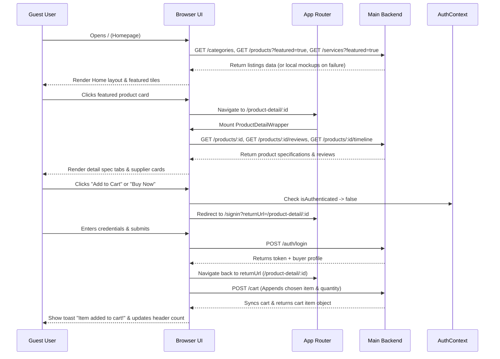
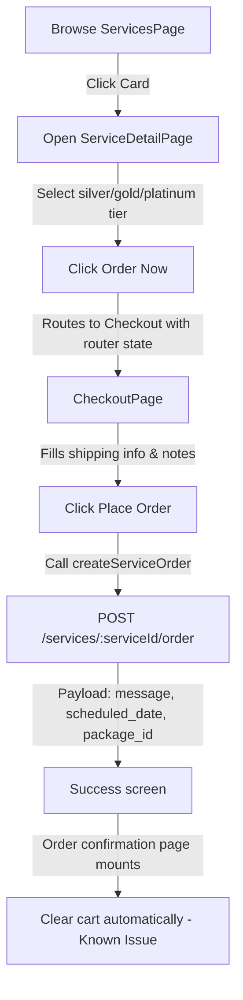
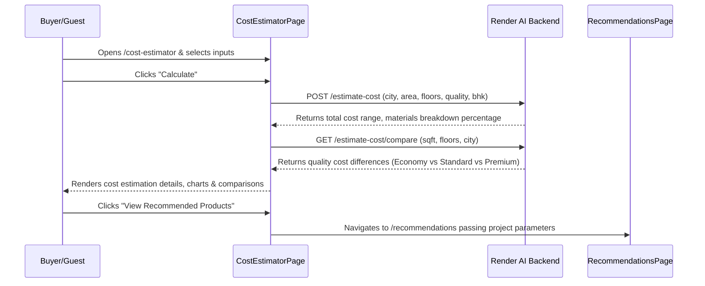

# BuildHive Market - Key User Journeys & Flows

This document maps the key user journeys through the application, detailing every component rendered, state update, network request, and visual change.

---

## FLOW 1: Guest Browses Products and Views Detail



### Step-by-Step Details
1. **Landing on Homepage**:
   - The browser mounts [HomePage.tsx](file:///E:/2025/FYP/FYP%20V2/buildhive-market/pages/HomePage.tsx).
   - In parallel, `useEffect` triggers requests to `GET /categories` and `GET /products?featured=true`.
   - Categories carousel and featured products grids render with hover scaling animations.
2. **Navigating to Detail Page**:
   - Guest clicks a product card, executing `onNavigate("product-detail", id)` which routes to `/product-detail/:id`.
   - The browser mounts `ProductDetailWrapper` in [App.tsx](file:///E:/2025/FYP/FYP%20V2/buildhive-market/App.tsx) which queries `productService.getProductById(id)` to load item details.
   - Once loaded, `ProductDetailPage` mounts, firing requests to fetch product reviews (`GET /products/:id/reviews`) and construction stage recommendations (`GET /products/:id/timeline`).
3. **Cart Redirect Gate**:
   - Guest clicks "Add to Cart". The handler in `AppContent` checks `isAuthenticated`.
   - Because they are a guest, the check fails. They are redirected to `/signin?returnUrl=%2Fproduct-detail%2F{id}`.
4. **Login and Return**:
   - Guest submits their login credentials. The `authService.login()` method completes and returns user credentials.
   - `SignInPage` intercepts the success, extracts the `returnUrl` query parameter, and navigates back to the product details page.
   - The user clicks "Add to Cart" again. This time `isAuthenticated` is true, triggering `cartService.addToCart(...)`.
   - The header cart count badge increments.

---

## FLOW 2: Buyer Completes Purchase (Product)

### Step 1: Add to Cart
* **Location:** `ProductsPage.tsx` or `ProductDetailPage.tsx`
* **Trigger:** Buyer clicks "Add to Cart" on a product card.
* **API Action:** `POST /cart` with payload: `{ productId: "{id}", quantity: 1 }`
* **State Updates:** The global `cart` state array in `App.tsx` updates, and the `<Header>` cart counter increments immediately.

### Step 2: Review Cart
* **Trigger:** Buyer clicks the cart icon in the header, navigating to `/cart`.
* **API Action:** `GET /cart` on mount to fetch up-to-date prices and stock levels.
* **User Action:** Buyer adjusts quantities or removes items, triggering optimistic UI updates and dispatching updates to `PUT /cart/:itemId` or `DELETE /cart/:itemId`.

### Step 3: Checkout Page
* **Trigger:** Buyer clicks "Proceed to Checkout", routing to `/checkout`.
* **API Action:** `GET /users/:userId/addresses` on mount to load saved shipping addresses.
* **Address Creation:**
  - If entering a new address, the form triggers `POST /users/:userId/addresses` before order placement to register it.
  - The payload sent to `addressService.createAddress` includes:
    ```json
    {
      "fullName": "Ayaan Khan",
      "addressLine1": "H# 12, St 4, DHA Phase 5",
      "city": "Lahore",
      "state": "Punjab",
      "postalCode": "54000",
      "country": "Pakistan",
      "phone": "+923001234567",
      "isDefault": true
    }
    ```

### Step 4: Payment Selection

#### Card Path (Stripe Gateway)
1. Buyer selects **Card Payment**. The UI displays the credit card inputs box.
2. Form submission triggers a call to create a payment intent: `POST /payments/create-payment-intent` sending the address ID and total price.
3. The server returns a `clientSecret`.
4. The client dispatches card credentials directly to Stripe using the SDK method: `stripe.confirmCardPayment(clientSecret, { payment_method: { card: cardElement } })`.
5. Upon confirmation, the client dispatches a request to confirm the payment on the backend: `POST /payments/confirm-payment` with payload `{ paymentIntentId: "pi_..." }`.
6. Once payment is confirmed, the client submits the order details: `POST /orders` with payload `{ addressId, paymentMethod: "card", paymentIntentId: "pi_..." }`.

#### Cash on Delivery (COD) Path
1. Buyer selects **Cash on Delivery**.
2. Clicking "Place Order" bypasses Stripe validation and directly submits the order details to the backend: `POST /orders` with payload:
   ```json
   {
     "shippingAddressId": "addr_123",
     "paymentMethod": "cod",
     "notes": "Please deliver after 2 PM"
   }
   ```

### Step 5: Success & Profile Review
* **Redirect:** The client navigates the router to `/order-confirmation/:orderId`.
* **Cleanups:** Calls `clearCart(true)` to reset the global cart array in `App.tsx`.
* **Verification:** The buyer navigates to `/account?tab=orders` to view their purchase history and download their PDF invoice.

---

## FLOW 3: Buyer Books a Service



### Step-by-Step Details
1. **Browse Service**: Buyer visits `/services` and clicks on a service card (e.g. Masonry Work), routing to `/services/:id`.
2. **Configure Package**: The buyer reviews Silver, Gold, and Platinum package details, selects a package card, and clicks "Order Now".
3. **Checkout Transition**: The click handler routes to `/checkout` with package information passed via the React Router history state (`state: { serviceCheckout: { ... } }`).
4. **Service Booking Call**: On `/checkout`, the page detects `serviceCheckout` state and hides the product cart summary. Clicking "Place Order" calls `serviceMarketplaceService.createServiceOrder` which hits:
   - `POST /services/:serviceId/order`
   - **Request Payload:**
     ```json
     {
       "message": "Need masonry work completed for living room wall",
       "scheduled_date": null,
       "package_id": null
     }
     ```
5. **Success Redirect**: Navigates to `/order-confirmation/:id`.
6. **Known Issue**: The confirmation handler calls `clearCart()`, which empties the user's shopping cart even though the purchase was for a service, not physical products in the cart.

---

## FLOW 4: Buyer Hires a Contractor

1. **Browse Directory**: Buyer navigates to the contractors list on the homepage or `/services` directory and selects a profile card, routing to `/contractors/:id`.
2. **Review Profile**: The browser mounts [ContractorProfilePage.tsx](file:///E:/2025/FYP/FYP%20V2/buildhive-market/pages/ContractorProfilePage.tsx).
3. **Open Booking Form**: Buyer clicks "Hire Me", opening the hiring modal container.
4. **Submit Project Scope**: Buyer fills out the form details and clicks "Submit Project".
5. **API Request**: The form dispatches the data to:
   - `POST /projects`
   - **Request Payload:**
     ```json
     {
       "contractorId": "usr_998",
       "title": "5 Marla Grey Structure Masonry",
       "description": "Require foundation and structure support work in Lahore.",
       "budget": 350000,
       "startDate": "2026-07-01",
       "deadline": "2026-09-01"
     }
     ```
6. **Success Feedback**: A success toast appears, the modal closes, and the new project is listed in the buyer's account projects tab (`/account?tab=projects`).

---

## FLOW 5: AI Cost Estimation



### Step-by-Step Details
1. **Inputs Configuration**: User opens `/cost-estimator` and inputs project details: Lahore, 5 Marla, Standard Quality, 2 Floors, 3 Bedrooms.
2. **Submit Calculation**: User clicks "Calculate".
3. **API Calculations**: The page fires two concurrent requests to the AI service:
   - `POST https://ai-backend-b3yd.onrender.com/estimate-cost` with payload:
     ```json
     {
       "sqft": 1125,
       "floors": 2,
       "quality": "Standard",
       "city": "Lahore",
       "bhk": 3,
       "bedrooms": 3,
       "washrooms": 2,
       "kitchens": 1,
       "projectType": "residential",
       "area": "5 Marla"
     }
     ```
   - `GET https://ai-backend-b3yd.onrender.com/estimate-cost/compare?sqft=1125&floors=2&city=Lahore`
4. **UI Render**: Displays estimated budgets, material percentage charts, and quality tier comparisons.
5. **Offline Fallback**: If the AI service is offline, the client catches the connection exception and falls back to manual house rates for calculation.

---

## FLOW 6: Registration as Seller/Contractor

1. **Click CTA**: A user browsing the public site wants to sell materials or offer services. They click the header button **Join as Seller / Contractor** (or scroll to the dashboard signup buttons on the landing page).
2. **Dashboard Redirect**: The client opens a new tab pointing to the dashboard application:
   - Target URL: `http://localhost:5000` (runs DashboardBuildhive portal).
3. **Account Creation**: The user creates their seller or contractor account within the dashboard portal, keeping business listings management separate from the public buyer marketplace.
