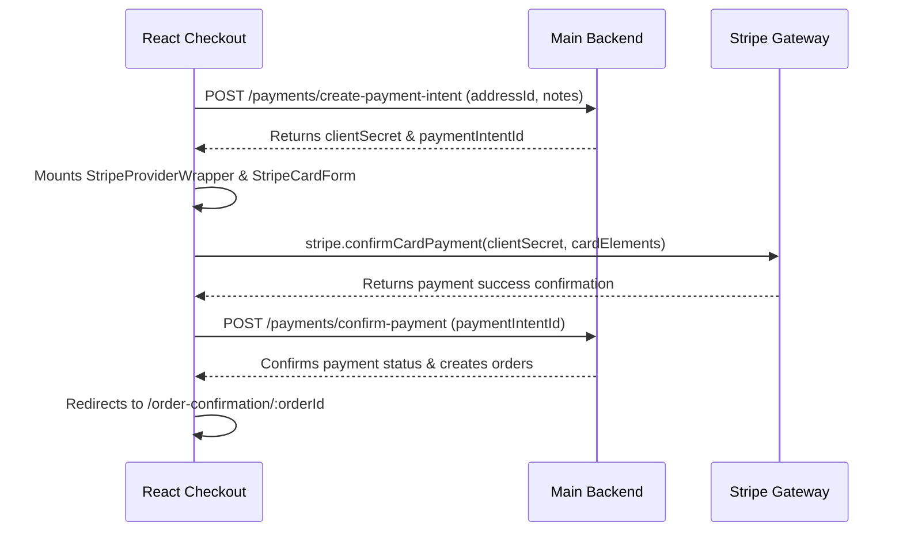

# BuildHive Market - CheckoutDeep Dive

This document details the checkout pipeline, covering payment paths, address creation, card gateways, order database creations, and known issues.

---

## State in CheckoutPage

The following state hooks are managed inside [CheckoutPage.tsx](file:///E:/2025/FYP/FYP%20V2/buildhive-market/pages/CheckoutPage.tsx):
* `paymentMethod` (`string`): Selected payment method (defaults to `"cod"`, other values: `"card"`, `"bank"`, `"easypaisa"`).
* `isProcessing` (`boolean`): Triggers spinners and blocks double-submissions during checkout execution.
* `orderPlaced` (`boolean`): Controls whether the success screen renders.
* `orderNumber` (`string`): The checkout order identification string returned by the database.
* `placedOrdersCount` (`number`): Counts the number of separate sub-orders generated during purchase.
* `showStripeForm` (`boolean`): Controls rendering of the Stripe credit card detail inputs modal.
* `createdOrderId` (`string | null`): Captures the ID of the newly created order record.
* `serviceCheckout` (`any | null`): Populated if checking out a service package instead of a shopping cart of products.
* `serviceLoading` (`boolean`): Tracks loading service details.
* `formData` (`FormData`): Delivery address inputs (full_name, phone, address_line1, address_line2, city, state, postal_code, country, notes).
* `errors` (`Record<string, string>`): Shipping validation error logs.
* `savedAddresses` (`any[]`): Stored user shipping addresses loaded from the profile.
* `selectedSavedAddressId` (`string`): Stored address identification selected by the user.
* `saveAddress` (`boolean`): Toggle indicating whether to save this shipping location to the user profile for future checkouts.

---

## Checkout Types

The checkout pipeline handles two distinct transaction types:
1. **Product Checkout (Cart Items):**
   - Triggered when a buyer clicks "Proceed to Checkout" from the shopping cart page.
   - The page receives a list of products through the `cartItems` array passed as props from `App.tsx`.
2. **Service Checkout (Single Service Package):**
   - Triggered when a buyer selects a service tier package and clicks "Order Now".
   - The route transitions to `/checkout` passing service details in the history state.
   - **Detection Logic:** On mount, `CheckoutPage` checks `location.state?.serviceCheckout`. If found, it fetches service details, hides shopping cart item rows, and updates checkout totals to reflect only the service package cost.

---

## Address Handling

### Stored Addresses
* On mount, `CheckoutPage` calls `userService.getAddresses(user.id)`. Stored locations are loaded into the `savedAddresses` array.
* Selecting an address from the dropdown populates the address form fields.

### Address Creation
* If no address exists or the buyer enters new details, the page registers the address before order creation:
  - Calls `addressService.createAddress(userId, payload)`.
  - The payload maps form fields: `fullName` -> `full_name`, `addressLine1` -> `address_line1`, etc.
* **Known Issue (Address Proliferation):** Entering a new address or checking out always creates a new address record in the database, even if it matches an existing saved entry, leading to duplicate shipping records in the user profile.
* **Required Fields:** Validation ensures `full_name`, `phone`, `address_line1`, `city`, `state`, and `postal_code` are filled before placing an order.

---

## Order Creation & Grouping

When checking out a shopping cart of physical products:
1. **Grouping Logic:** The client aggregates subtotal calculations by seller using the `cartGroups` hook.
2. **Database Order Creation:**
   - The client dispatches a single order package to `POST /orders`:
     ```json
     {
       "items": [
         { "product_id": "prod_1", "quantity": 2, "price": 1500 }
       ],
       "shippingAddressId": "addr_991",
       "paymentMethod": "cod",
       "notes": "Deliver weekday morning"
     }
     ```
3. **Backend Processing:**
   - The backend Express API intercepts the payload, groups the items by seller/business, and creates separate sub-orders (one per seller) to track fulfillment independently.
   - **Fractions Warning:** If creating one sub-order fails (e.g. out of stock) while another succeeds, the backend database may resolve to a partial success state where some items are booked and others are rejected.

---

## Stripe Payment Flow

If the buyer selects **Card Payment** during checkout:



1. **useStripePayment Hook:** Coordinates Stripe-specific API requests, wrapping the payment intent creation and confirmation endpoints.
2. **StripeCardForm Component:** Renders the credit card inputs (CardNumber, CardExpiry, CardCvc) inside Stripe Elements.
3. **Payment Intent Creation:** The form calls `POST /payments/create-payment-intent`. The server returns the `clientSecret` and `paymentIntentId`.
4. **Card Charge Confirmation:** The client calls `stripe.confirmCardPayment(clientSecret)`. This securely dispatches card details directly to Stripe's servers.
5. **Backend Order Sync:** On Stripe success, the client calls `confirmPaymentToBackend(paymentIntentId)` via `POST /payments/confirm-payment`. The backend updates payment records, creates the orders, and returns the generated `orderId`.

---

## Cash on Delivery (COD) Flow

1. Buyer selects COD.
2. Clicking "Place Order" dispatches the order payload directly to `POST /orders`.
3. The server creates the order records with payment status marked as `"pending"`.
4. The client redirects to `/order-confirmation/:id`, showing a success message: `"Order placed successfully! Pay on delivery."`

---

## Service Checkout

* For service transactions, the client bypasses product order APIs and calls `createServiceOrder`:
  - Hits: `POST /services/:serviceId/order`
  - **Payload:** `{ message: formData.notes, scheduled_date: null, package_id: null }`
* **Known Issue (Cart Wipe):** Upon successful service order placement, the code calls `clearCart()`. This clears the buyer's product shopping cart, even though the service booking was a separate transaction unrelated to the cart.

---

## Success State

* **Confirmation Render:** Navigates the router to `/order-confirmation/:orderId`.
* **Order Number Display:** Renders the order reference number in a green success card.
* **Known Issue (Order Number Fallbacks):** If the backend does not return an order number field, the page generates a fallback reference using the first 8 characters of the order ID: `orderId.substring(0, 8).toUpperCase()`.

---

## Tax Calculation

* **Tax Rate:** A flat **5% tax rate** is applied to checkout totals (defined as `TAX_RATE = 0.05` in `checkoutPageData.ts`).
* **UI Display:** Subtotals, 5% taxes, and final grand totals are calculated on the fly and displayed in the right-hand pricing panel.
  $$\text{Tax Amount} = \text{Subtotal} \times 0.05$$
  $$\text{Grand Total} = \text{Subtotal} + \text{Tax Amount}$$
